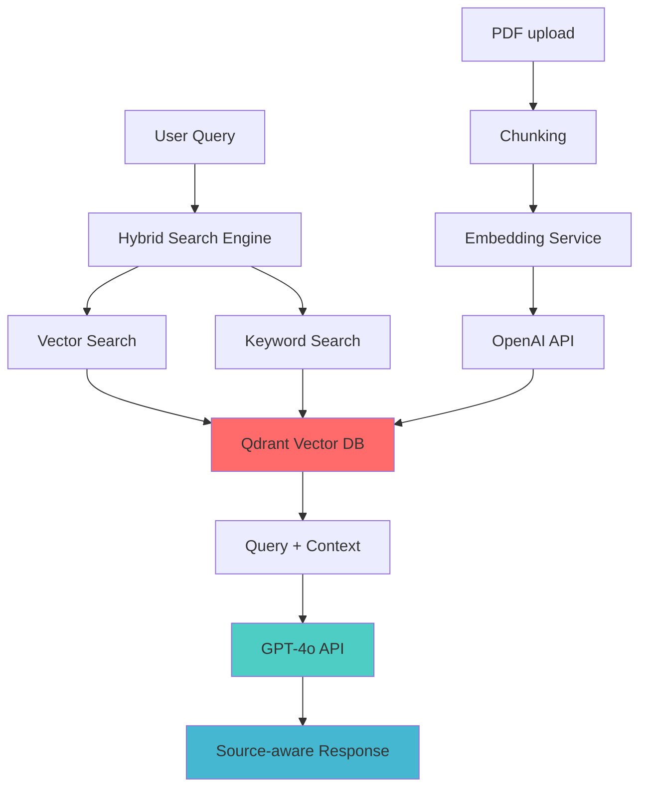

# HR RAG Assistant

[](https://www.python.org/downloads/)
[](https://github.com/langchain-ai/langchain)
[](https://github.com/langchain-ai/langgraph)
[](https://fastapi.tiangolo.com/)
[](https://qdrant.tech/)

**HR-RAG-ASSISTANT** is a production-focused Retrieval-Augmented Generation (RAG) system designed to assist company employees with the HR-related questions. The system combines Qdrant's powerful vector database with advanced search capabilities and presents the following features:

✅ Combines semantic and keywords search (hybrid retrieval)  
✅ Gives source-aware answers with retrieval-backed context  
✅ Implements observability with LangSmith tracing for optimized performance  
✅ Provides FastAPI application with health checks  

## 🏛️ High-Level Architecture

<div align="center">



</div>

## 🚀 Quick Start

### 📋 Prerequisites

- **Python 3.12+**
- **UV Package Manager** ([Install Guide](https://docs.astral.sh/uv/getting-started/installation/))
- **Docker Desktop**
- **API Keys:** OpenAI, LangSmith, Qdrant

**1. Clone repository**
```bash
git clone https://github.com/sabina-kairatova/hr-rag-assistant.git
cd hr-rag-assistant
```

**2. Configure environment**
```bash
cp .env.example .env
```
Edit `.env` with your configuration.

**3. Install dependencies**
```bash
uv sync
```

**4. Start all services**
```bash
docker compose up --build -d
```

**4. Start all services**
```bash
curl -f http://localhost:8000/health
```

### **🏗️ Project Structure**

```
hr-rag-assistant/
├── app/                        # Main application code
│   ├── main.py                 # API endpoints (chat, health, metrics)
│   ├── agents.py               # LangGraph agent
│   ├── models.py               # Pydantic validation schemas
│   ├── config.py               # Environment configuration
│   ├── cache.py                # In-memory response cache with TTL 
│   ├── monitoring.py           # Log records for log aggregation
│   ├── security.py             # Security pipeline for input and output processing
│   ├── tools.py                # RAG retrieval tools
│   ├── prompts.py              # Prompts for LLM 
│   ├── embeddings.py           # OpenAI embeddings configuration
│   ├── vectore_store.py        # Qdrant vector store configuration
│   ├── hybrid_search.py        # Hybrid retrieval
│   └── build_knowledge_base.py # Build and load HR knowledge base
├── tests/                      # Test suite
├── data/                       # RAG knowledge base
├── Dockerfile                  # Project container
└── docker-compose.yml          # Docker service orchestration
```

### **📡 API Endpoints Reference**

| Endpoint | Method | Description |
|----------|--------|-------------|
| `/health` | GET | Service health check |
| `/metrics` | GET | Metrics for monitoring dashboard|
| `/cache/stats` | GET | Cache performance statistics |
| `/chat` | POST | Main chat endpoint |

**API Documentation:** Visit http://localhost:8000/docs for interactive API explorer
